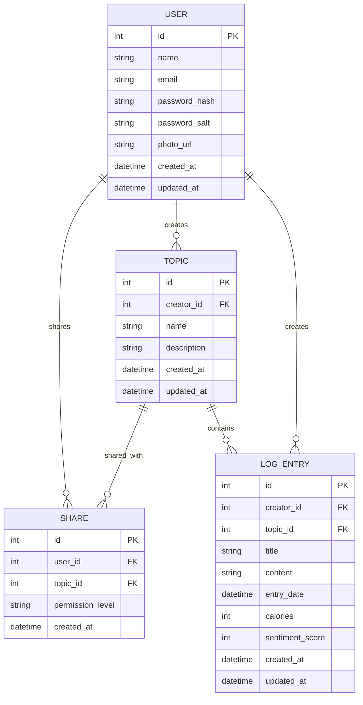

# MealBuddy Data Model

## Prompt Used
For starters, let's think about the data model here. Below is an incomplete draft of the data model for the system. Consider the user experience of the application and complete the data model for this app. My thought is that each user will have their own account, which they can log in to create so-called topics of meal entries for more customizability. One example is that if the user prefers to separate their meal entries by the month. For each of the topic, there can be multiple log entries created or edited by the owner of that topic OR the user whom the topic was shared with. The display of the entries in the log will consist of multiple meal entries that are grouped by the date which the entry was made to the topic. Each of these entries contains a required title and optional fields like the content, calorie count, etc. I think that's a good spot to stop at in terms of the features for this application.

## Data Model Design Decisions

### 1. User Entity
- **Photo URL**: Added `photo_url` field to store profile image references
- **Timestamps**: Included `created_at` and `updated_at` for audit trails
- **Security**: Proper password hashing with salt for secure authentication

### 2. Topic Entity
- **Creator Relationship**: `creator_id` links topics to their creators
- **Flexibility**: Added `description` field for users to explain topic purpose
- **Timestamps**: Audit trails for topic creation and updates

### 3. Share Entity (Many-to-Many Relationship)
- **Permission Levels**: `permission_level` field allows granular access control
- **User-Topic Association**: Enables collaboration between users
- **Timestamps**: Track when sharing was initiated

### 4. Log Entry Entity
- **Required Fields**: `title` is required as specified in the prompt
- **Optional Fields**: Content, calories, and sentiment score for rich data
- **Date Tracking**: `entry_date` for organizing meals chronologically
- **Relationships**: Links entries to both users and topics
- **Timestamps**: Audit trails for entry creation and updates

### 5. Relationship Design
- **User-Topic**: One-to-many (users can create many topics)
- **User-LogEntry**: One-to-many (users can create many entries)
- **Topic-LogEntry**: One-to-many (topics can contain many entries)
- **User-Share**: One-to-many (users can be shared with many topics)
- **Topic-Share**: One-to-many (topics can be shared with many users)

## ERD Diagram
